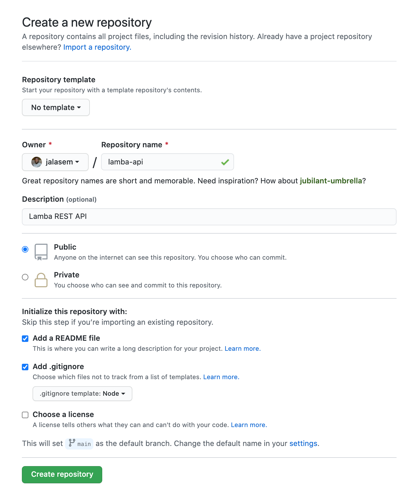
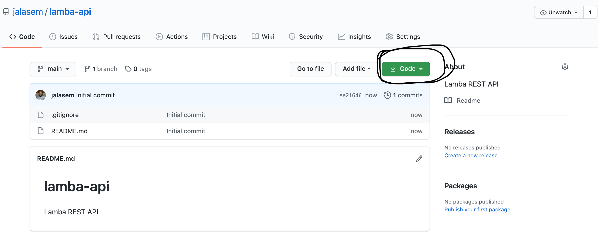
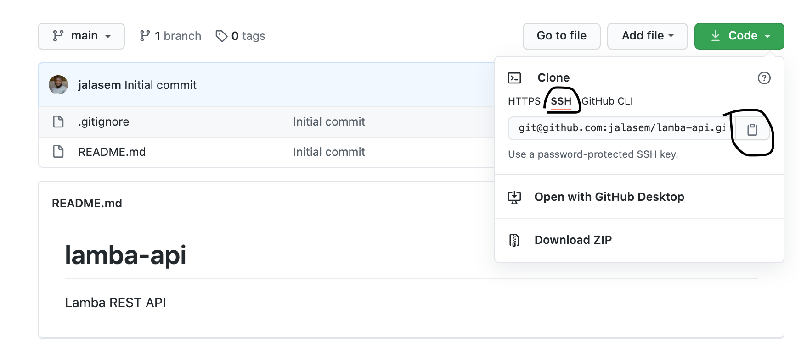

# How to setup a Node/ExpressJS API Project

### Create your project repository
Create a repo on Github for your new Node project. Give it a name &description. 
- Choose whether you want the repo to be private or public. 
- Add .gitignore and select Node



- Upon creating your repository copy the ssh link of the project




### Clone the repo
In your terminal, navigate to your project folder and run

```bash
git clone <repo_link>
```
this will clone the files from your Github repo to your laptop
- `cd` into the newly cloned  project and run 
```bash
npm init
```
- Answer all the questions accordingly, that should create a file named `package.json` for you.
- In your terminal, install your dev dependencies; `eslint, babel & nodemon`

```bash
npm i -D eslint nodemon @babel/node @babel/cli @babel/core @babel/plugin-transform-async-to-generator @babel/plugin-transform-runtime @babel/preset-env
```

### set project configurations
- create `babel.config.json`

```JSON
{
  "presets": ["@babel/preset-env"],
  "plugins": ["@babel/plugin-transform-runtime"]
}
```

In your project directory, create `src/index.js` file and create a simple server in it like so
```js
import express from 'express'
const app = express()

app.get('/', (req, res) => {
	res.send('Hello world')
})

app.listen(9090, () => {
	console.log('Server is running on port 9090')
})
```

- In your `package.json`, let's add some scripts
```JSON
{
	...
	"script": {
	  "dev": "nodemon --exec babel-node src",
      "start": "node dist/",
      "lint": "./node_modules/.bin/eslint . --fix",
      "build": "npm run lint && babel src -d dist"
	},
	...
}
```

Install express as a dependency

```bash
npm i express
```

Be sure to initialize your eslint like so;
```bash
npx eslint --init
```
- choose `To check syntax, find problems, and enforce code style`
- select `JavaScript modules (import/export)`
- under which framework, select `none of these`
- where does your code run? Check `Node` only
- How would you like to define a style for your project? select `Use a popular style guide`
- choose `Standard: [https://github.com/standard/standard](https://github.com/standard/standard)`
- What format do you want your config file to be in? select `JSON`
- Would you like to install them now with npm? Choose `Yes`
*suggestions above can be modified based on your speicfic project need*

- Create `.eslintignore` file and exclude `dist` folder like so
```
dist/**
```
Finally let's create `nodemon.json`
```JSON
{
  "verbose": false,
  "delay": "0",
  "ignore": ["*.test.js", "dist/*"]
}
```

### Run your code

```bash
npm run dev
```

You should get a message in the console that reads

`Server is running on port 9090`

**Commit and push your work to Github**

💪🏽👨🏽‍💻🚀
